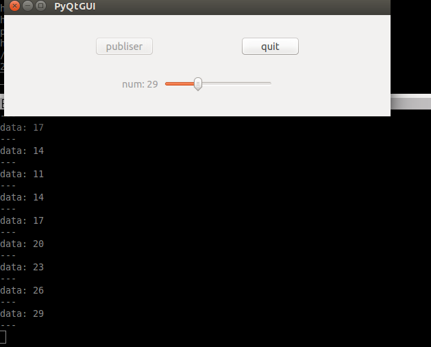
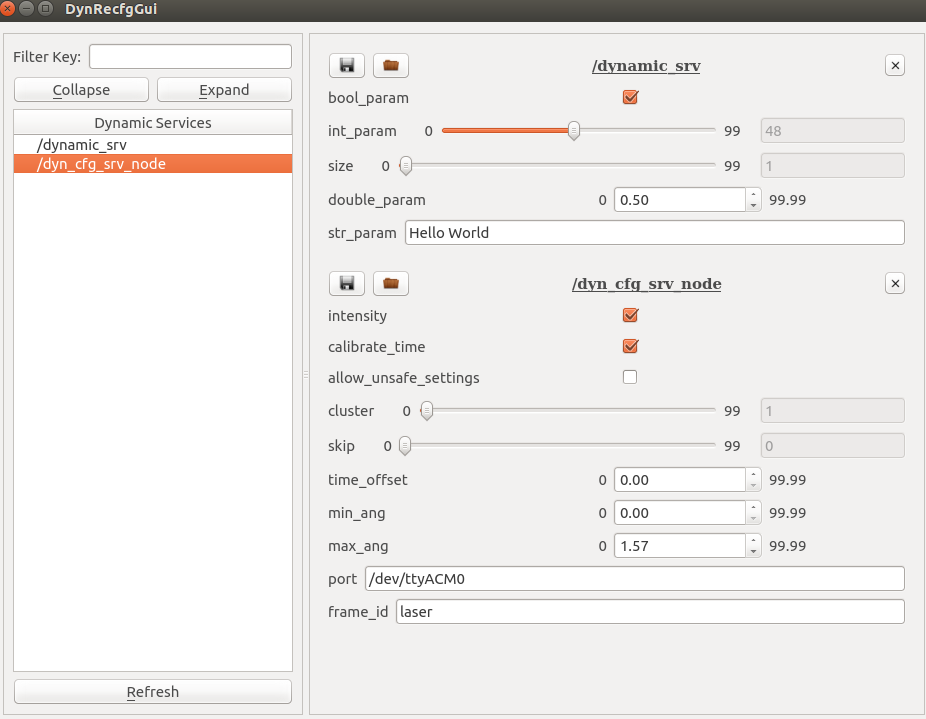
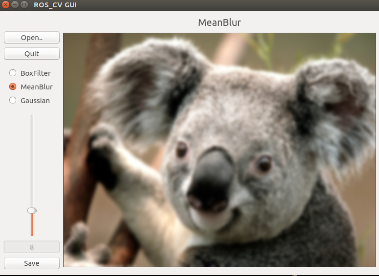
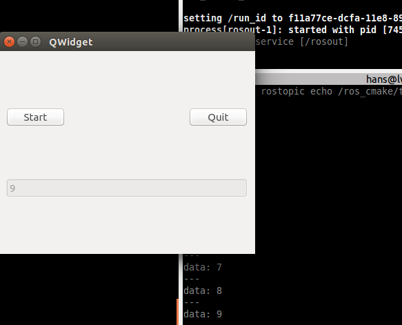

## Author
- **Welin**  2018.02.23
- modified in 2018.10.31

## Overview
In the project, so many ways are provided to implement ROS-Qt GUI, namely rqt, such as qt4, qt5, pyqt4. Also ROS could be treated as a open-source library to extend some other module by using CMAKE, not just using catkin_make/rosbuild, to make the development more flexible.

## Description
* In this project, three approaches are provided to implement ROS&Qt GUI and another two projects for PyQt GUI.
* In the test_gui package, it just modified the example in catkin_create_qt_pkg depending on qt_build using Qt4 library.
* In the rqt_mypkg package, it is the C++ rqt_plugin test depending on rqt_gui_cpp.
* In the qt_ros_test package, it combines ROS with Qt5 library.

The above three are written in C++ programmer.
The following two below are written in Python.

* In the ros_pyqt package, it uses PyQt (PyQt4) to implement the GUI.
* In the pyqt_gui package, it uses PyQt and python_qt_binding to implement the GUI.


In the qt4rosgui package, it uses Qt4 libraries to implement the ROS-GUI **NOT** depends on qt-ros package (namely command `catkin_create_qt_pkg`).

In the librviz_test package, it uses librviz to build a visualizer tool for display using Qt4.

For more complicated examples, please see the package dyn_cfg_gui or ros_cv_gui, it is the implementation for rqt_reconfigure and some image processing by using OpenCV and Qt5. Also see [ROS_dynamic_reconfig](https://github.com/WelinLee/ROS_dynamic_reconfig "ROS_dynamic_reconfig"), [ros_cv_qt_gui](https://github.com/WelinLee/ros_cv_qt_gui) and [ros_opencv_pro](https://github.com/WelinLee/ROS_OPENCV_PRO) for detail.

## TODO
```sh
    $ mkdir -p catkin_ws/src
    $ cd catkin_ws/src
```

git clone the project from the corrent URL

```sh
    $ cd ..
    $ catkin_make
    $ source devel/setup.bash
```

Then, `rosrun test_gui test_gui` or `rosrun qt_ros_test qt_ros_test_node` or `rosrun qt4rosgui qt4rosgui_node`. The effect is below:


To run the rqt_mypkg, just open rqt (`rosrun rqt_gui rqt_gui`), and the "rqt first C++ plugin" could be found in the Plugins menu. The effect is below:


To run ros_pyqt *or* pyqt_gui, just using the command `python ros_pyqt` or `python pyqt_gui`. The effect is below:



If you have a mobile robot such as TurtleBot or else, the slam navigation status could be shown as below. Just `run ros vizlib_test vizlib_test_node`.


Using `rosrun dyn_cfg_gui dyn_cfg_gui` command, the effect is shown below.



The ros&opencv example is also provided as shown below. 
```sh
    $ rosrun ros_cv_gui ros_cv_gui_node
```



###  **Especially**,
the ros_cmake package could be separated in a individual directory, not using catkin_make/rosbuild.
```sh
    $ mkdir build
    $ cd build
    $ cmake ..
    $ make
    $ ./ros_cmake     #the executable program
```
The effect is shown below, the topic has been subscribed. Remember to open roscore at first.




Enjoy!